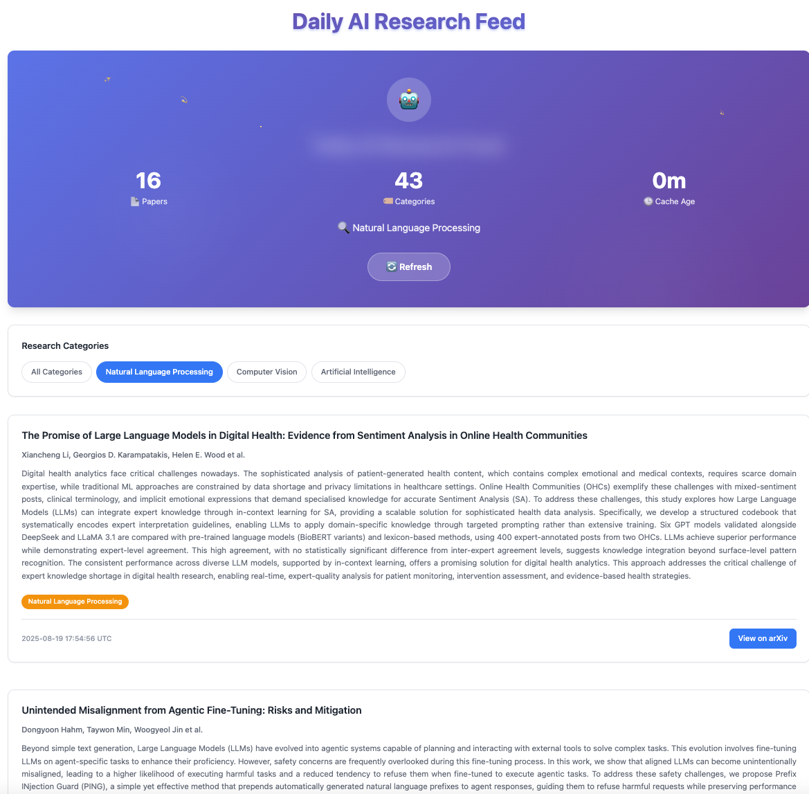

# Daily AI Research Feed 🤖✨

A beautiful, modern web application for browsing the latest AI research papers from arXiv. Features a stunning glittery UI, real-time caching, and category filtering.



## ✨ Features

- **Beautiful UI**: Glittery animations, gradient backgrounds, and professional design
- **Real-time Data**: Fetches latest papers from arXiv API
- **Smart Caching**: 30-minute cache with automatic daily refresh
- **Category Filtering**: Filter by AI, Computer Vision, and NLP
- **Responsive Design**: Works perfectly on desktop and mobile
- **Single Column Layout**: Easy reading with full abstracts
- **Professional Styling**: Clean, modern interface perfect for research

## 🚀 Quick Start

### Using Docker (Recommended)

```bash
# Clone the repository
git clone <your-repo-url>
cd daily-ai-research-feed

# Run with Docker Compose
docker-compose up -d

# Access the application
open http://localhost:5001
```

### Local Development

```bash
# Install uv (if not already installed)
curl -LsSf https://astral.sh/uv/install.sh | sh

# Install dependencies
uv sync

# Run the application
uv run python app.py

# Access the application
open http://localhost:5001
```

## 📁 Project Structure

```
daily-ai-research-feed/
├── backend/                 # Backend services
│   ├── __init__.py
│   ├── arxiv_service.py    # ArXiv API integration
│   ├── cache_manager.py    # Caching logic
│   └── paper_service.py    # Main service layer
├── frontend/               # Frontend components
│   ├── __init__.py
│   ├── components.py       # UI components
│   └── styles.py          # CSS styling
├── app.py                 # Main FastHTML application
├── Dockerfile             # Docker configuration
├── docker-compose.yml     # Docker Compose setup
├── requirements.txt       # Python dependencies
└── README.md             # This file
```

## 🎨 UI Features

### Glittery Header
- Animated gradient text with shimmer effects
- Floating sparkles and rotating icons
- Professional glass-morphism design

### Smart Statistics
- Visual stats with icons (📄 Papers, 🏷️ Categories, 🕒 Cache Age)
- Real-time cache information
- Clean, dashboard-like appearance

### Category Filtering
- Filter by main AI categories
- Active state highlighting
- Smooth transitions

### Paper Cards
- Full abstracts (no truncation)
- Color-coded category badges
- Professional typography
- Hover effects and animations

## 📸 Screenshots

The application features a beautiful, modern interface with:

- **Glittery animated header** with gradient effects and floating sparkles
- **Professional card layout** with full paper abstracts
- **Smart category filtering** for AI, Computer Vision, and NLP
- **Real-time statistics** showing cache status and paper counts
- **Responsive design** that works on all devices

*Screenshot: `daily_research.png` - Shows the main interface with glittery header, stats dashboard, and paper cards*

## 🔧 Configuration

### Environment Variables

```bash
# Optional: Customize cache duration (default: 30 minutes)
CACHE_DURATION_MINUTES=30

# Optional: Customize fetch parameters
ARXIV_MAX_RESULTS=100
ARXIV_DAYS_BACK=2
```

### Docker Configuration

The application includes:
- Multi-stage Docker build for optimization
- Non-root user for security
- Health checks for monitoring
- Volume mounts for logs

## 📊 API Endpoints

- `GET /` - Main application page
- `GET /?category=cs.AI` - Filter by category
- `GET /refresh` - Force refresh papers from arXiv
- `GET /debug` - Cache status and debugging info

## 🏗️ Architecture

### Backend Services
- **ArxivService**: Handles arXiv API communication
- **CacheManager**: Manages in-memory caching with daily refresh
- **PaperService**: Combines API and caching logic

### Frontend Components
- **Modular Components**: Reusable UI components
- **Responsive Styles**: Professional CSS with animations
- **FastHTML Integration**: Server-side rendering with modern UX

## 🚀 Deployment

### Production with Docker

```bash
# Build and run
docker-compose up -d

# View logs
docker-compose logs -f

# Stop
docker-compose down
```

### Production with Gunicorn

```bash
# Install production dependencies
uv add gunicorn

# Run with Gunicorn
uv run gunicorn -w 4 -k uvicorn.workers.UvicornWorker app:app --bind 0.0.0.0:5001
```

## 🔍 Monitoring

### Health Checks
- Built-in health check endpoint at `/debug`
- Docker health checks included
- Cache status monitoring

### Logs
- Application logs to stdout
- Docker logs available via `docker-compose logs`
- Optional volume mount for persistent logs

## 🎯 Categories Supported

- **Artificial Intelligence** (cs.AI)
- **Computer Vision** (cs.CV)  
- **Natural Language Processing** (cs.CL)
- **Machine Learning** (cs.LG)
- **Neural Networks** (cs.NE)
- **Statistical ML** (stat.ML)

## 🤝 Contributing

1. Fork the repository
2. Create a feature branch
3. Install dependencies with `uv sync`
4. Make your changes
5. Test with `uv run python app.py` or Docker
6. Submit a pull request

## 📝 License

MIT License - see LICENSE file for details

## 🙏 Acknowledgments

- Built with [FastHTML](https://fastht.ml/) for modern web development
- Data from [arXiv.org](https://arxiv.org/) API
- Inspired by the need for beautiful research tools

---

**Daily AI Research Feed** - Making AI research discovery beautiful and efficient! ✨🚀